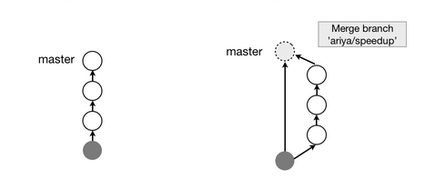

# CLONE AND BRANCHING

## COLLABORATING

	git clone <url> <folder_name>
	
### GIT CLONE

1. Downloads the entire repository into a new git-real directory.
2. Adds the 'origin' remote, pointing it to the clone URL.
3. Checks out initial branch (master) and sets the head.

## BRANCHING OUT

	git branch <name>
	git branch // see the branchs
	git checkout <branch_name>  //jump to the branch
	
You also can do:

	git checkout -b <branch_name> //create a branch then checkout
	
### TIME TO MERGE

	git checkout master
	git merge <branch_name>
	
### BRANCH CLEAN UP

	git branch -d <brach_name>
	
### FAST-FORWARD && NON-FAST-FORWARD

**FAST-FORWARD**: 

For example, we did changes on the branch, but not on the master. 
Looks like linear tree

**NON-FAST-FORWRD**:

On the master and branch, we both made changes.
Better because it keeps the information who at which branch do what.

Checkout this [article](http://ariya.ofilabs.com/2013/09/fast-forward-git-merge.html).

	

	
