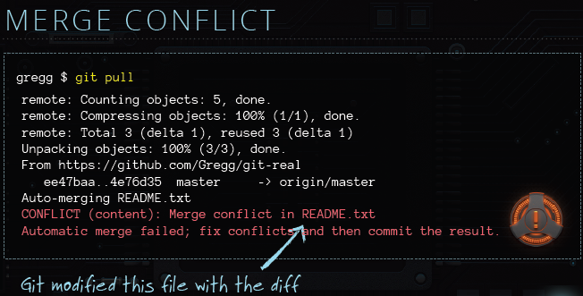
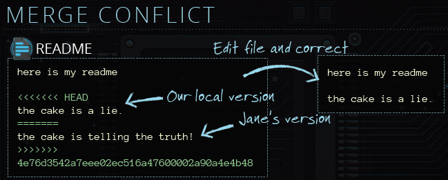

# COLLABORATION BASICS

## TWO NEW FILES

For example you are working on one file called 'index.html' and you commit it locally.
At the same time, your co-work working on another file called 'README.md' and committed and pushed to the remote.

When you want to push you changes to remote, you will see git reject your changes.
Because you don't have your co-work changes in your local.

So what you need to do is :

	git pull
	git push
	
## THE SAME FILE

It also may happen that you and your co-work working on the same file.
And he pushed to the remote, and yours are still in local. OK, again, you try

	git pull
	
But this time you saw *MERGE CONFLICT*,

what you need to do then is to open 'README.md' file

Fix the conflict.

After that,

	git commit -a //Leave message empty, it will pup up a editor 
	git push
