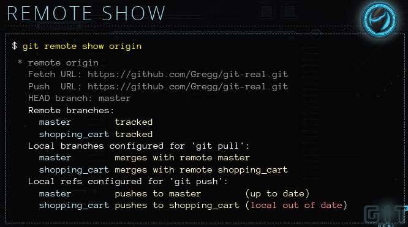
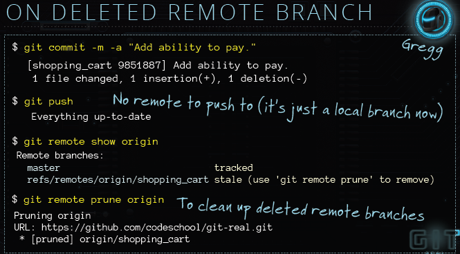
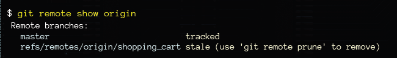

# REMOTE BRANCHES & TAGS

## WHY CREATE A REMOTE BRANCH?

* When you need other people to work on your branch.
* Any branch that will last more than a day.

## CREATING A REMOTE BRANCH

	git checkout -b <branch_name>
	git push origin <branch_name>  // Links local branch to the remote branch (tracking)
	
## PUSH TO THE BRANCH 

	git add --all
	git commit -am "commit message"
	git push
	
## PULLING NEW BRANCHES

	git pull   // get new branch from remote
	git branch // see the local branch
	git branch -r // list all remote branches
	git checkout <branch_name> // get new branch and switch to that branch

## REMTOE SHOW

	git remote show origin
	
	
	
Using this we can see which local branch is out of date and which is up to date

## REMOVING A BRANCHING

	git push origin :<remote_branch_name>  //deletes remote branch
	git branch -d <local_branch_name>  // delete local branch
	
If when you want to delete a local branch, it shows the error that the branch is not fully merged and you want to delete anyway:

	git branch -D <local_branch_name>
	

Sometime it may happen that, you want to push changes to a remote branch which has been deleted by co-worker:
It shows everything is up to date.

You can run:
	
	git remote show origin
	
to see all the remote branch. And you will notice that the shopping_cart branch is removed from the remote.
Then you can run:

	git remote prune origin
	
to clean up the deleted remote branches.

# HEROKU

Let say you currently have two branch:
	
	git branch
	
* master
* staging

**Heroku only deploys the master branch.** So if you do:

	git push heroku-staging staging

(_heroku-staging_ is the heroku name), this won't work.

But you want the staging branch get deployed, you can do:

	git push heroku-staging staging:master
	
# TAGGIN

	git tag  //list all tags
	
	git checkout v0.0.1
	
	git tag -a v0.0.3 -m "Version0.0.3"
	
	git push --tags
	
	
# IN EXECRICES:

###PUSH BRANCH
A new kind of pet is for sale at the store! Maybe this one will catch on with the public. You've committed your work to the local hamsters branch; now publish this branch in the origin repo.

	git push origin hasmets
	
###GET REMOTE BRANCH
"git branch -r" does not query the remotes to check for new branches. In order to see a new remote branch you first have to do a fetch or a pull. So retrieve the remote "weasel" branch.
[The question is mean to say, if you use git fetch, you can also see the new branch information]

	git fetch
	
###REMOTE BRANCHES
Your co-worker said he wants you to look over a new branch on "origin", but he didn't tell you its name. Get a list of remote branches.

	git branch -r
	
###DELETE ON REMOTE
Guess how the product launch went with the weasels? Better delete the "weasel" branch on "origin".

	git push origin :weasel
	
###BRANCH STATUS
Wait, did you already pull that branch locally? Check for stale branches that are tracking "origin".
	
	git remote show origin

  remote origin
  Fetch URL: https://git@pshop.com/petshop_online/petshop.git
  Push  URL: https://git@pshop.com/petshop_online/petshop.git
  HEAD branch: master
  Remote branch:
    master tracked
  Local branch configured for 'git pull':
    weasel merges with remote weasel
  Local ref configured for 'git push':
    master pushes to master (local out of date)
	
	
###CLEAN BRANCHES
You still have a stale local branch tracking the now-deleted origin/weasel. Clean up your local references.

	git remote prune origin
	
###LIST TAGS
With the weasel threat eliminated, the pet store wants to deploy the site. Let's see, what was the previous version number? Display the tags to find out.

	git tag
	
###CREATE TAG
Ah, yes, the last release was "v1.3.1". You've added the hamsters, so it would be best to release this as "v1.3.2". Create a tag accordingly.

	git tag -a v1.3.2 -m "version 1.3.2"
	
###SEND TAGS
Push your tag to origin.

	git push --tags
	
###RETRIEVE TAG
The client is requesting that you roll back to the prior release. (Seriously? What could have gone wrong with the hamsters?) Retrieve the release tagged "v1.3.1".

	git checkout v1.3.1

