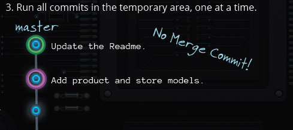

# REABSE

Normally we fell merge commits feel useless, they are bad!
When there are conflicts between master and origin/master, we can do merge:

	git pull
	git push

But this time, we say **NOPE** to it, because we don't want merge commits.

###FETCH
So instead we do 'pull', this time we do fetch:

	git fetch
	
Remember 'fetch' only get the latest changes, but NOT merge them.

## Time to REBASW

Rebase does three things:

	git rebase
	
1. Move all changes to master which are not in origin/master to a temporary area.

2. Run all origin/master commits on master

3. Run all commits in the temporary area, one at a time

So this no merge commit!

## LOCAL BRANCH REBASE

Now we have two branch, master and admin branch. On each branch we have commits.
If we want to do rebase on the admin branch.

	git checkout admin
	git rebase master

What it does is move everythig not on the master to a temp area, run master on admin branch one at a time. Then run commits on temp area on master one a time.

### If ALL GOES WELL, MERGE MASTER

	git checkout master
	git merge admin

### WHAT ABOUT CONFLICTS

	
	
What we need to do is:

1. FETCH
	
	git fetch
	
2. REBASE

	git rebase
	
3. REBASE CONFLCIT

	<fix conflicts>
	git add <file>
	git rebase --continue
	
