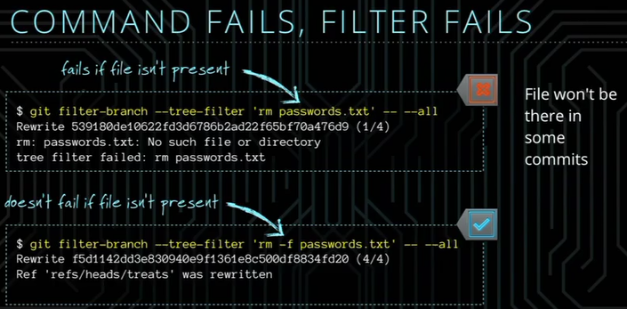
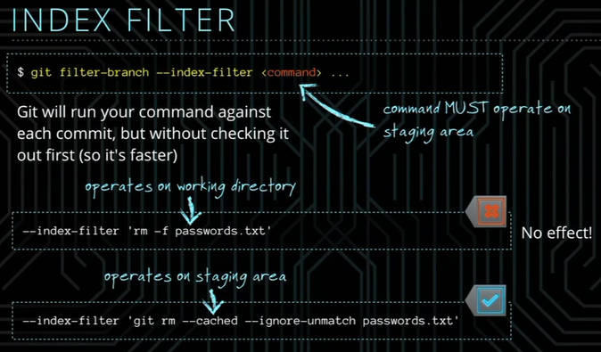
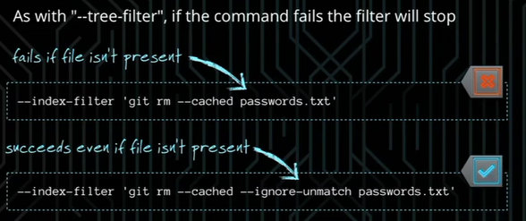
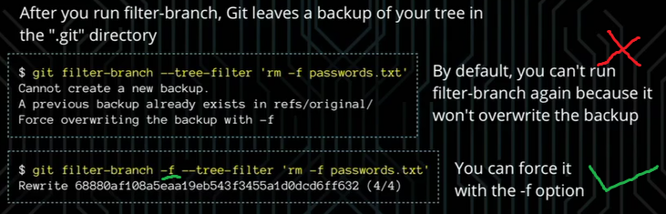

# PURGING HISTORY

Let'say John push the password.txt by mistake. Because Git keep everything so even you use another commit to delete this file, but history is stil there.
So there is way to rewrite history...

### BEFORE WE CONTINUE...

* Reasons not to rewrite history:
	* why bother? You data is already compromised.
	* Everyone must update their work to reflect your revised commits.
	
* When you should do it anyway:
	* Committed files violate someone's copyright.
	* Large binary file making your repo too big.
	* You're rewriting commits that haven't been made public.
	

#### Make Backup

     git clone petshop petshop-filter  // Cloning into 'petshop-filter'
	 
## Tree filter

	git filter-branch --tree-filter <command> ...
	
Git will check each commit out into working directory, run your command, and re-commit

Example:

	--tree-filter 'rm -f password.txt'  //Remove "passwords.txt" from project root
	--tree-filter 'find . -name "*.mp4" -exec rm {} \;' //Remove videos files from any directory
	

	git filter-branch --tree-filter 'rm -f passwords.txt' -- --all //Goes through all branches, and removes "passwords.txt" from each commit
	git filter-branch --tree-filter 'rm -f passwords.txt' -- --HEAD // filter only current branch
	
** -f: ** If without -f, because not each commit contains passwrods.txt, if they don't have, if will fails, then all the filter will fails.

## INDEX FILTER

As you can image, run each commits and recommit it take for a while. So you can use INDEX filter.

	git filter-branch --index-filter <command> ...
	
** command MUST operate on staging area **.
Git will run your command against each commit, but without checking it out first (so it is faster)

## FORCE

## PRUNE EMPTY COMMITS

	git filter-branch -f --prune-empty -- --all // --prune-empty option drops commits that don't alter any files
	
You can also prune during filtering, too:

	git filter-branch --tree-filter 'rm -f password.txt' --prune-empty -- --all
	
# In Execrise

###REPO COPY
Now you've done it. You accidentally put the company's master password into one of your files. You're beginning to panic because you know that it's pretty hard to delete something forever in git. That's what you really need to do, though, or you're in big trouble. You're going to need to purge the history. First, though, make a copy of your repo in case you mess it up. Make a copy of the poodles repository, and name it whatever you want.

	git clone poodles poodles-filter
	
###TREE FILTER
Luckily for you, the password you accidentally committed was in the master_password.txt file. Use the filter-branch command and remove this file from all of your commits.

	git filter-branch --tree-filter 'rm -f master_password.txt' 
	
###INDEX FILTER
This repository is so large, using --tree-filter is going to take all day. Use --index-filter to remove master_password.txt instead. Remember, --index-filter will need a command that works on the staging area, which is going to be some sort of git command.

	git filter-branch --index-filter 'git rm --cached --ignore-unmatch master_password.txt'
	
###FORCE
You just realized that you also have a master_username.txt file that should probably be removed too, just to be safe. Use either technique you have learned to remove this file. Don't forget, you have a history backup from the first time you used filter-branch. Use the correct option to force git to overwrite it.

	git filter-branch -f --index-filter 'git rm --cached --ignore-unmatch master_username.txt'
	
###PRUNING

Great! Now we're getting somewhere. There is one more problem though, you realize that some of the commits don't contain anything anymore, since you removed the password file that they referenced. You should probably use the --prune-empty option do something to clean these out.
	
	git filter-branch -f --prune-empty -- --all
	
