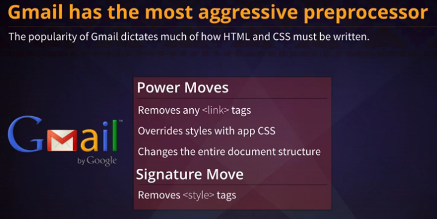
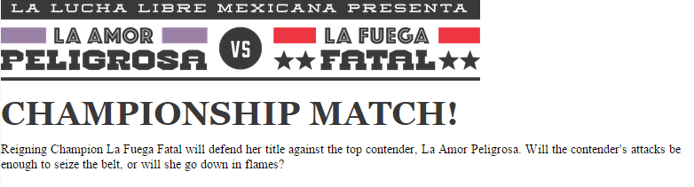
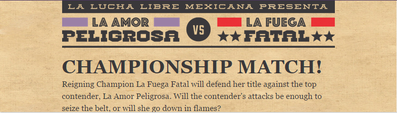

# Clients and Markup

The native email client is different from browser client:


So you must: 

1. absolute url for image
2. Add inline style for the element
3. Consider browser default behaviour

### Execrise:

##### Adding and Styling the First Image
The first bit of content to add is an image at the top of the email. It needs a combination of HTML attributes and inline styles to appear correctly.

* Begin by adding an img tag with a source of https://s3.amazonaws.com/unmasking-html-emails/info.png.
* Set the alt text for the image to La Amor Peligrosa vs. La Fuega Fatal.
* Add inline styles to the image to set its display property to "block" and max-width property to "100%".
* Use the width attribute to set the width of the image to 600 pixels, keeping in mind that the width attribute defaults to pixels.

```html
<!DOCTYPE html>
<html>
  <head>
    <meta charset="utf-8">
    <title>Championship Match!</title>
    <meta name="viewport" content="width=device-width" />
  </head>
  <body style="margin: 0; padding: 0;">
    
  </body>
</html>
```


#####Style the Primary Heading

We want a large title that spans most of the available space. Use inline CSS to style the h1 element.

* Set the color of the h1 to #3a383a.
* Continue styling the h1 by setting it to a font-family of Georgia, serif and a font-size of 42px.
* Adjust the weight and case of the title by setting the font-weight to bold and setting text-transform to uppercase.
* Override any default styles on the h1 by setting the line-height to 42px and the margin to 0.
* Separate the heading from the image by applying "20px" to the padding-top of the h1.

```html
<!DOCTYPE html>
<html>
  <head>
    <meta charset="utf-8">
    <title>Championship Match!</title>
    <meta name="viewport" content="width=device-width" />
  </head>
  <body style="margin: 0; padding: 0;">
    
    <h1 style="color: #3a383a;
               font-family: Georgia, serif;
               font-size: 42px;
               font-weight: bold;
               line-height: 42px;
               margin: 0;
               padding-top: 20px;
               text-transform: uppercase;">Championship Match!</h1>
    <p>Reigning Champion La Fuega Fatal will defend her title against the top contender, La Amor Peligrosa. Will the contender's attacks be enough to seize the belt, or will she go down in flames?</p>
  </body>
</html>
```




#####Style the First Paragraph
We need to use more inline styles so the p appears correctly.

* Set the color of the text to #3a383a.
* Use the font-family Georgia, serif and a font-size of 18px for the paragraph.
* Override any default styles by applying a line-height of 27px and a margin of 0 on the p.
* Separate the paragraph from the heading by applying a padding-top of "5px" to the p.

```html
<!DOCTYPE html>
<html>
  <head>
    <meta charset="utf-8">
    <title>Championship Match!</title>
    <meta name="viewport" content="width=device-width" />
  </head>
  <body style="margin: 0; padding: 0;">
    
    <h1 style="color: #3a383a; font-family: Georgia, serif; font-size: 42px; font-weight: bold; line-height: 42px; margin: 0; padding-top: 20px; text-transform: uppercase;">Championship Match!</h1>
    <p style="
              color: #3a383a;
              font-family: Georgia, serif;
              font-size: 18px;
              line-height: 27px;
              margin: 0;
              padding-top: 5px;">
      Reigning Champion La Fuega Fatal will defend her title against the top contender, La Amor Peligrosa. Will the contender's attacks be enough to seize the belt, or will she go down in flames?
    </p>
  </body>
</html>
```


#####Containing the Content

We want the content to have a maximum width and to be centered, so we'll use a container element.

* First, wrap all of the existing content inside of a div tag.
* Restrict the width on the div to "600px" using max-width and then center it using "0 auto" for its margin.

```html
<!DOCTYPE html>
<html>
  <head>
    <meta charset="utf-8">
    <title>Championship Match!</title>
    <meta name="viewport" content="width=device-width" />
  </head>
  <body style="margin: 0; padding: 0;">
    <div style="max-width: 600px; margin: 0 auto;">
    
    <h1 style="color: #3a383a; font-family: Georgia, serif; font-size: 42px; font-weight: bold; line-height: 42px; margin: 0; padding-top: 20px; text-transform: uppercase;">Championship Match!</h1>
    <p style="color: #3a383a; font-family: Georgia, serif; font-size: 18px; line-height: 27px; margin: 0; padding-top: 5px;">Reigning Champion La Fuega Fatal will defend her title against the top contender, La Amor Peligrosa. Will the contender's attacks be enough to seize the belt, or will she go down in flames?</p>
    </div>
  </body>
</html>
```
!()[./images/4.png]


#####Apply a Background Using a Wrapper

We want a textured background for the viewable area, so we'll use a wrapper element with a background image that falls back to a background color.

* Create a new div tag that will contain the existing div.
* Apply a background-color of "#e4c59a" and a background-image with the url of "https://s3.amazonaws.com/unmasking-html-emails/bg.jpg" to the new div.

```html
<!DOCTYPE html>
<html>
  <head>
    <meta charset="utf-8">
    <title>Championship Match!</title>
    <meta name="viewport" content="width=device-width" />
  </head>
  <body style="margin: 0; padding: 0;">
    <div style="background-color: #e4c59a;
                background-image: url(https://s3.amazonaws.com/unmasking-html-emails/bg.jpg);">
      <div style="margin: 0 auto; max-width: 600px;">
        
        <h1 style="color: #3a383a; font-family: Georgia, serif; font-size: 42px; font-weight: bold; line-height: 42px; margin: 0; padding-top: 20px; text-transform: uppercase;">Championship Match!</h1>
        <p style="color: #3a383a; font-family: Georgia, serif; font-size: 18px; line-height: 27px; margin: 0; padding-top: 5px;">Reigning Champion La Fuega Fatal will defend her title against the top contender, La Amor Peligrosa. Will the contender's attacks be enough to seize the belt, or will she go down in flames?</p>
      </div>
    </div>
  </body>
</html>
```
