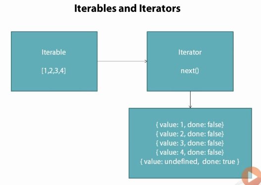
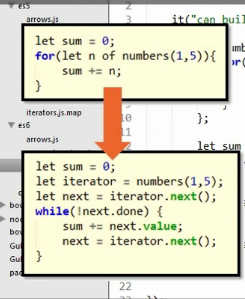
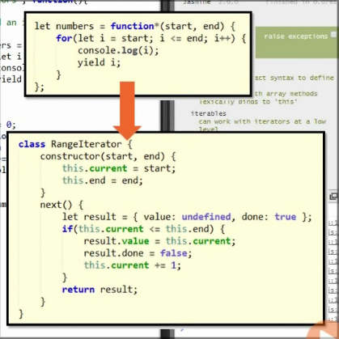

# Functional Programming

## Arrow Functions

No need function, return keyword, {}. 
```
// When there are more than one param, we need ()
let add =  (x, y) => x+ y;
let three = () => 3;
// When there is only one param, we can skip ()
let square = x => x * x;
// When we have mutli lines, we do need {}
let subtraction = (x, y) => {
	let temp = x - y;
	return temp;
}
expect(add(3,5)).toBe(8);
expect(square(3)).toBe(9);
expect(three()).toBe(3);
expect(subtraction(5,3)).toBe(2);
```

```
it("can be used with array methods", function(){
	
	var numbers = [1,2,3,4];
	
	var sum = 0;
	numbers.forEach(n => sum += n;);
	expect(sum).toBe(10);
	
	var doubled = numbers.map(n => n * 2);
	expect(doubled).toEqual([2,4,6,8]);
})
```


## Arrows and Asynch

Many times you would need callback function, one painful thing is **this** keyword.

If in ES5
```
it("It will fail in ES5 ", function(done){
	
	//this bind to jasmine global scope
	this.name = "Wan";
	setTimeout(function(){
		//here this bind to this callback function
		epxect(this.name).toBe("Wan");
		done();  //call done() to tell jasmine, the test is over
	}, 15);
})
```

We can solve this problem use this way in ES5:
```
it("It will fail in ES5 ", function(done){
	var self = this;
	self.name = "Wan";
	setTimeout(function(){
		epxect(self.name).toBe("Wan");
		done();  
	}, 15);
})
```

Use arrow function, we not longer need to worry about the this:
```
it("It will work in ES6", function(done){
	this.name = "Wan";
	setTimeout(() => {
		expect(this.name).toBe("Wan");
		done();
	})
})
```

There is a good example with AngularJS from this [article](http://toddmotto.com/es6-arrow-functions-syntaxes-and-lexical-scoping/).

Angular with ES5:
```
function FooCtrl (FooService) {
  var that = this;
  that.foo = 'Hello';
  FooService
  .doSomething(function (response) {
    that.foo = response;
  });
}
```

Angular with ES6:
```
function FooCtrl (FooService) {
  this.foo = 'Hello';
  FooService
  .doSomething((response) => { // woo, pretty
    this.foo = response;
  });
}
```

## Iterators



```
describe("iterables", function(){
	it("can work with iterators at a low level", function(){
		
		let sum = 0;
		let numbers = [1,2,3,4];
		
		//for loop
		sum = 0;
		for(let i = 0; i < numbers.length; i++){
			sum += numbers[i];
		}
		expect(sum).toBe(10);
		
		// for in
		sum = 0;
		for(let i in numbers){
			// i is the key of numbers
			sum += numbers[i];
		}
		expect(sum).toBe(10);
		
		//iterator
		sum = 0;
		let iterator = numbers.values(); //call values() method return a iterator
		let next = iterator.next();
		//keep move to next until there is a done prop
		while(!next.done){
			//get value
			sum += next.value;
			// move next
			next = iterator.next();
		}
	})
});
```

## for of

Javascript comes with **for..in** which is useful when deal with key-value pair:

```
let numbers = [1,2,3,4];
for(let i in numbers){
	console.log(numbers[i]);
}

var person = {first: "Zhentian", last: "Wan"}
for(let key in person){
	console.log(person[key]);
}
```

It is great! But sometime we just want to get value not worry about the key of the array.
There **for..of** comes in handy. It just looks for value. And one benefit of that is it can work with iterators.

```
let numbers = [1,2,3,4];
for(let val of numbers){
	console.log(val); //1 2 3 4
}
```

```
describe("for of", function(){
	it("can work with iterators at a high level", function(){
		
		let sum = 0;
		let numbers = [1,2,3,4];
		
		for(let val of numbers){
			sum += val;
		}
		
		expect(sum).toBe(10);
	})
});
```

Quick introduction of 'Symbol':

     let iterator = numbers.values(); //call values() method return a iterator
	 
can be replace with this:

	  let iterator = number[Symbol.iterator]();
	  
## Build your own iteratable

```
class RangeIterator{
	constructor(start,end){
		this.current = start;
		this.end = end;
	}
	//should have next method
	next(){
		// when call next(), it will return an object with 'value' and 'done' flag
		let result = {value: undefine, done: false};
		if(this.current <= this.end){
			result.value = this.current;
			result.done = false;
			this.current += 1;
		}else{
			//keep moving until the end of array
			//mark the done flag to true
			result.done = true;
		}
		
		return result;
	}
}
```

## Generators

In last section, we see how to build a iteratable class.
ES6 has 'Generator' for this:

* It has 'yield' which return an object with value and done props.
* function*() 

```
let numbers = function*(){
	yield = 1;
	yield = 2;
	yield = 3;
	yield = 4;
}

let sum = 0;
let iterator = numbers();
let next = iterator.next();
while(!next.done){
	sum += next.value;
	next = iterator.next();
}
expect(sum).toBe(10);
```




```
describe("generators", function(){
	it("can build an iterable", function(){
		//numbers is iterators
		let numbers = function*(start, end){
			for(let i = start; i < end; i++){
				console.log(i);
				yield i;
			}
		};
		
		let sum = 0;
		console.log("next");
		// go thought iterators to get value
		for(let n of numbers(1,5)){
			sum += n;
			console.log(next);
		}
		
		expect(sum).toBe(15);
	})
})
```

## Putting it together

## Calling next

