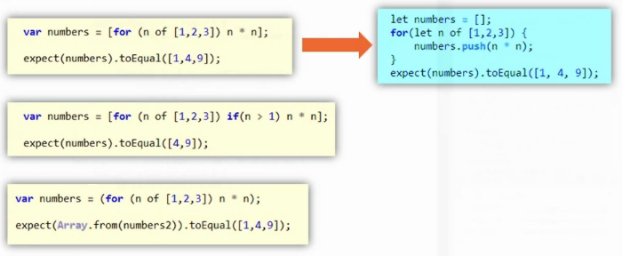
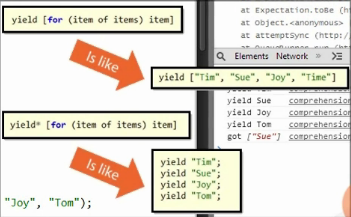

# Functional Programming

## Arrow Functions

No need function, return keyword, {}. 
```
// When there are more than one param, we need ()
let add =  (x, y) => x+ y;
let three = () => 3;
// When there is only one param, we can skip ()
let square = x => x * x;
// When we have mutli lines, we do need {}
let subtraction = (x, y) => {
	let temp = x - y;
	return temp;
}
expect(add(3,5)).toBe(8);
expect(square(3)).toBe(9);
expect(three()).toBe(3);
expect(subtraction(5,3)).toBe(2);
```

```
it("can be used with array methods", function(){
	
	var numbers = [1,2,3,4];
	
	var sum = 0;
	numbers.forEach(n => sum += n;);
	expect(sum).toBe(10);
	
	var doubled = numbers.map(n => n * 2);
	expect(doubled).toEqual([2,4,6,8]);
})
```


## Arrows and Asynch

Many times you would need callback function, one painful thing is **this** keyword.

If in ES5
```
it("It will fail in ES5 ", function(done){
	
	//this bind to jasmine global scope
	this.name = "Wan";
	setTimeout(function(){
		//here this bind to this callback function
		epxect(this.name).toBe("Wan");
		done();  //call done() to tell jasmine, the test is over
	}, 15);
})
```

We can solve this problem use this way in ES5:
```
it("It will fail in ES5 ", function(done){
	var self = this;
	self.name = "Wan";
	setTimeout(function(){
		epxect(self.name).toBe("Wan");
		done();  
	}, 15);
})
```

Use arrow function, we not longer need to worry about the this:
```
it("It will work in ES6", function(done){
	this.name = "Wan";
	setTimeout(() => {
		expect(this.name).toBe("Wan");
		done();
	})
})
```

There is a good example with AngularJS from this [article](http://toddmotto.com/es6-arrow-functions-syntaxes-and-lexical-scoping/).

Angular with ES5:
```
function FooCtrl (FooService) {
  var that = this;
  that.foo = 'Hello';
  FooService
  .doSomething(function (response) {
    that.foo = response;
  });
}
```

Angular with ES6:
```
function FooCtrl (FooService) {
  this.foo = 'Hello';
  FooService
  .doSomething((response) => { // woo, pretty
    this.foo = response;
  });
}
```

## Iterators


```
describe("iterables", function(){
	it("can work with iterators at a low level", function(){
		
		let sum = 0;
		let numbers = [1,2,3,4];
		
		//for loop
		sum = 0;
		for(let i = 0; i < numbers.length; i++){
			sum += numbers[i];
		}
		expect(sum).toBe(10);
		
		// for in
		sum = 0;
		for(let i in numbers){
			// i is the key of numbers
			sum += numbers[i];
		}
		expect(sum).toBe(10);
		
		//iterator
		sum = 0;
		let iterator = numbers.values(); //call values() method return a iterator
		let next = iterator.next();
		//keep move to next until there is a done prop
		while(!next.done){
			//get value
			sum += next.value;
			// move next
			next = iterator.next();
		}
	})
});
```

## for of

Javascript comes with **for..in** which is useful when deal with key-value pair:

```
let numbers = [1,2,3,4];
for(let i in numbers){
	console.log(numbers[i]);
}

var person = {first: "Zhentian", last: "Wan"}
for(let key in person){
	console.log(person[key]);
}
```

It is great! But sometime we just want to get value not worry about the key of the array.
There **for..of** comes in handy. It just looks for value. And one benefit of that is it can work with iterators.

```
let numbers = [1,2,3,4];
for(let val of numbers){
	console.log(val); //1 2 3 4
}
```

```
describe("for of", function(){
	it("can work with iterators at a high level", function(){
		
		let sum = 0;
		let numbers = [1,2,3,4];
		
		for(let val of numbers){
			sum += val;
		}
		
		expect(sum).toBe(10);
	})
});
```

Quick introduction of 'Symbol':

     let iterator = numbers.values(); //call values() method return a iterator
	 
can be replace with this:

	  let iterator = number[Symbol.iterator]();
	  
## Build your own iteratable

```
class RangeIterator{
	constructor(start,end){
		this.current = start;
		this.end = end;
	}
	//should have next method
	next(){
		// when call next(), it will return an object with 'value' and 'done' flag
		let result = {value: undefine, done: false};
		if(this.current <= this.end){
			result.value = this.current;
			result.done = false;
			this.current += 1;
		}else{
			//keep moving until the end of array
			//mark the done flag to true
			result.done = true;
		}
		
		return result;
	}
}
```

```
describe("Build a iterator by myself", function(){

	it("Symbol.iterator", function(){
		
		class Company{
			constructor(){
				this.employees = [];
			}
			
			addEmployees(...names){
				//concat return a new array
				this.employees = this.employees.concat(names);
			}
			
			[Symbol.iterator](){
				return  new ArrayIterator(this.employees);
			}
		}
		
		class ArrayIterator{
			constructor(array){
				this.array = array;
				this.index = 0;
			}
			
			next(){
				var result = {value: undefine, done: true};
				if(this.index < this.array.length){
					result.value = this.array[this.index];
					result.done = false;
					this.index++;
				}
				return result;
			}
		}
		
		let count = 0;
		let company = new Company();
		company.addEmployees('Tom', "Jim", "Kate", "Tim");
		
		for(let employee of company){
			count++;
		}
		expect(count).toBe(4);
	})
});
```

## Generators

In last section, we see how to build a iteratable class.
ES6 has 'Generator' for this:

* It has 'yield' which return an object with value and done props.
* function*() 

```
let numbers = function*(){
	yield = 1;
	yield = 2;
	yield = 3;
	yield = 4;
}

let sum = 0;
let iterator = numbers();
let next = iterator.next();
while(!next.done){
	sum += next.value;
	next = iterator.next();
}
expect(sum).toBe(10);
```


```
describe("generators", function(){
	it("can build an iterable", function(){
		//numbers is iterators
		let numbers = function*(start, end){
			for(let i = start; i < end; i++){
				console.log(i);
				yield i;
			}
		};
		
		let sum = 0;
		console.log("next");
		// go thought iterators to get value
		for(let n of numbers(1,5)){
			sum += n;
			console.log(next);
		}
		
		expect(sum).toBe(15);
	})
})
```

## Putting it together

From last 'Company' example, we can use generator to improve the code.

* First we don't need to write ourselves ArrayIterrator class.
* Then we make `[Symbol.iterator]()` as a generator function by adding '*'.
* Loop though the **employees** array and **yield** the each employee.

So the company class should looks like:

```
      class Company{
      	constructor(){
      		this.employees = [];
      		console.log("Company constructor...");
      	}
      			
      	addEmployees(...names){
      		//concat return a new array
      		this.employees = this.employees.concat(names);
      	}
      			
      	*[Symbol.iterator](){
      		for(var e of this.employees){
      			yield e;
      		}
      	}
      } ; 
```

We can also add **filter** logic, filter also should be a genrator function:

```
      var filter = function*(items, prediction) {
      	for(var item of items){
      		if(prediction(item)){
      			yield item;
      		}
      	}
      };
```

Let's also create a **pick** function, it yield out the number of person you want:

```
      var pick = function*(items, num){
      	// if just pick 0 person, just return;
      	if(num < 1) return;
      	var count = 0;
      	for(var item of items){
      		yield item;
      		count++;
      		if(count >= num){
      			return;
      		}
      	}
      };
```

If in generator function use **return**, it will set **done: true**.

So put it together: 
```
describe("Build a iterator by myself", function(){

	it("Symbol.iterator", function(){
		
      class Company{
      	constructor(){
      		this.employees = [];
      		console.log("Company constructor...");
      	}
      			
      	addEmployees(...names){
      		//concat return a new array
      		this.employees = this.employees.concat(names);
      	}
      			
      	*[Symbol.iterator](){
      		for(var e of this.employees){
      			yield e;
      		}
      	}
      } ; 
      
      
      var filter = function*(items, prediction) {
      	for(var item of items){
      		if(prediction(item)){
      			yield item;
      		}
      	}
      };
      
      var pick = function*(items, num){
      	// if just pick 0 person, just return;
      	if(num < 1) return;
      	var count = 0;
      	for(var item of items){
      		yield item;
      		count++;
      		if(count >= num){
      			return;
      		}
      	}
      };   
      
      
		var count = 0;
		console.log("start");
		var company = new Company();
		company.addEmployees('Tom', "Jim", "Kate", "Tim");
		console.log(company);
		
		for(var employee of pick(filter(company, (e) => e[0] == "T"),1)){
			count++;
		}
		expect(count).toBe(1);
	})
});
```
[Notice:] If you use treacur and in the generator, you use 'let' instead of 'var' may cause problem, see the [issue on github](https://github.com/google/traceur-compiler/issues/33)


## Calling next

```
describe("next() method can take paramter also", function(){
	it("should be a odd array", function(){
		let range = function*(start, end){
			var current = start;
			while(current <= end){
				yield current;
				current += 1;
			}
		} 
	});
	
	let result = [];
	let iterator = range(1,10);
	let next = iterator.next();
	while(!next.done){
		result.push(next.value);
		next = iterator.next();
	}
	
	expect(result).toEqual([1,3,5,7,9]); //false, [1,2,...,10]
});
```

The code above failed the test. We want [1,3,5,7,9], but actually result is [1...10].
Of course we can change:
     
	 current += 2; //instead of current += 1;

But this is not the best choice.

```
describe("next() method can take paramter also", function(){
	it("should be a odd array", function(){
		let range = function*(start, end){
			var current = start;
			while(current <= end){
				var delta = yield current;
				current += delta || 1;
			}
		} 
	});
	
	let result = [];
	let iterator = range(1,10);
	let next = iterator.next();
	while(!next.done){
		result.push(next.value);
		next = iterator.next(2);
	}
	
	expect(result).toEqual([1,3,5,7,9]); //ture
});
```

`next(parameter)` can take parameter which will affect will yield result. **[Notice: ] The first next() call cannot take parameter.**
so we pass '2' to next():

```
	while(!next.done){
		result.push(next.value);
		next = iterator.next(2);
	}
```

But how to get this parameter in generator function? Actually **yield** method will return the value that next() pass in. If next() has not param, then it is undefined.

```
var delta = yield current; // delta = 2;
```

Read: [article](http://www.cnblogs.com/Answer1215/p/4117501.html)


## Comprehensions

Read: [Article](http://www.cnblogs.com/Answer1215/p/4114647.html)



From the image, we see the last is **generator comprehension**.

So what is the difference between generator comprehension and array comprehension?
The main difference is generator comprehension is **lazy**, array comprehension is **greedy**.
generator will do as less work as possible, but array will finish all jobs at once.

If using array comprehension, it returns a new array:

```
var numbers = [for(n of [1,2,3]) n * n];
console.log(numbers);  // [1, 4, 9]
```

If using generator comprehension, it returns a generator object:

```
let iterator = (for(n of [1,2,3]) n * n); // iterator is a generator object
let next = iterator.next();
let result = [];
while(!next.done){
	result.push(next.value);
	next = iterator.next();
}

console.log(result); //[1,4,9]
```

We use last example we saw:

```
describe("Build a iterator by myself", function(){

	it("Symbol.iterator", function(){
		
      class Company{
      	constructor(){
      		this.employees = [];
      		console.log("Company constructor...");
      	}
      			
      	addEmployees(...names){
      		//concat return a new array
      		this.employees = this.employees.concat(names);
      	}
      			
      	*[Symbol.iterator](){
      		for(var e of this.employees){
				console.log("yield ", e)
      			yield e;
      		}
      	}
      } ; 
      
      
      var filter = function*(items, prediction) {
      	for(var item of items){
      		if(prediction(item)){
      			yield item;
      		}
      	}
      };
      
      var pick = function*(items, num){
      	// if just pick 0 person, just return;
      	if(num < 1) return;
      	var count = 0;
      	for(var item of items){
      		yield item;
      		count++;
      		if(count >= num){
      			return;
      		}
      	}
      };   
           
		var count = 0;
		var company = new Company();
		company.addEmployees('Tom', "Jim", "Kate", "Tim");
		
		for(var employee of pick(filter(company, (e) => e[0] == "K"),1)){
			count++;
			console.log("got", employee);
		}
		expect(count).toBe(1);
	})
});
```

We rewrite filter function by using array comprehension:

```
      var filter = function*(items, prediction) { 
		yield [for(item of items) if(prediction(item)) item];
      };
```

And print out what we got from the result: 

```
		for(var employee of pick(filter(company, (e) => e[0] == "K"),1)){
			count++;
			console.log("got", employee);
		}
```

And in company generator, we print out each yielded items

```
      	*[Symbol.iterator](){
      		for(var e of this.employees){
				console.log("yield ", e)
      			yield e;
      		}
      	}
```

We got :
    yield  Tom
	yield  Jim
	yield  Kate
	yield  Tim
	got ["Kate"]
	  
Notice that, now we didn't got each employee individually, but an array! ["Kate"]
If we want to get each employee individually, we can append an '*' after yield.

```
      var filter = function*(items, prediction) { 
		yield* [for(item of items) if(prediction(item)) item];
      };
```

We got:
 yield  Tom
 yield  Jim
 yield  Kate
 yield  Tim
 got Kate




But in the company generator, we still yield all the items, we want it do less work, be lazy!
The reason it yield all items is that in the filter function, we use array comprehension, it will go thought all array items.

So if you change to generator comprehension:

```
      var filter = function*(items, prediction) { 
		yield* (for(item of items) if(prediction(item)) item);
      };
```

We got:

	yield  Tom
	yield  Jim
	yield  Kate
	got Kate
	
Now it do less work, it will improve the performance of our application.

