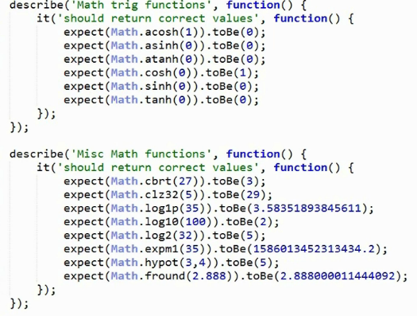
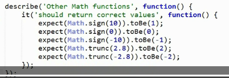
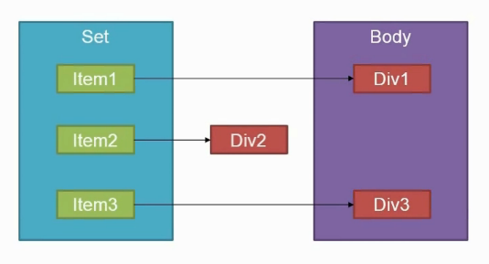

# Build-in Object
 
##Number

```
describe("Numbers", function(){

	it("Should easily mistake numbers with leading zeros", function(){
		//For example, in ES5 if you write 71 as 071, it would be a octal number, the real value is 57
		var octal = 071;
		expect(parseInt(octal)).toBe(57);
	});
	
	it("ES6 should support octal literals", function(){
		var octal = 0o71;  //leading 0o
		expect(octal).toBe(57);
	});
	
	it("should parse octal values with Number function", function(){
		var octNum = Number("0o71");
		expect(octNum).toBe(57);
	});
	
	it("should parse binary values with Number function", function(){
		var binNum = Number("0b101");  //leading 0b
		expect(binNum).toBe(5);
	});
	
	//parseInt and parseFloat in ES6 is the method of Number object, no global function any more
	it("Should expose parseInt and parseFloat", function(){
		expect(Number.parseInt("3").toBe(3));
		expect(Number.parseFloat("3.5").toBe(3.5));
	});
	
	it("should not conver strings when calling Number.isFinite vs global", function(){
		expect(isFinit("3").toBe(true)); 
		expect(Number.isFinit("1").toBe(false));
	});
	
	it("should not conver strings when calling Number.isNaA vs global", function(){
		expect(isNaN("NaN").toBe(true)); 
		expect(Number.isNaN("NaN").toBe(false));
	});	
	
	it("should correctly detect integers with isInteger", function(){
	
		//new function
		expect(Number.isInteger(1).toBe(true));
		expect(Number.isInteger(1.0).toBe(true));
		expect(Number.isInteger(1.5).toBe(false));
	});
	
	it("should expose max and min safe integer constants", function(){
		//In ES5
		expect(Math.pow(2,53)).toBe(Math.pow(2,53)+1); //true ....
		expect(Math.pow(2,53)+3).toBe(Math.pow(2,53)+9); //true
		
		//In ES6
		expect(Number.MAX_SAFE_INTEGER).toBe(Math.pow(2,53)-1);
		expect(Number.MAX_SAFE_INTEGER).toBe(Math.pow(2,53)*-1+1);
	});
	
	it("should indicate safe integers with isSafeInteger", function(){
		expect(Number.isSafeInteger(9007199254740991)).toBe(true);
		expect(Number.isSafeInteger(9007199254740992)).toBe(false);
	});
})
```

## Math




## Array

#### find()

     var match = [1,5,10].find(item => item > 8); // 10

#### findIndex()

     var match = [1,5,10].findIndex(item => item > 3); // 5

#### fill()

	  var ary = [1,2,3,4,5];
	  ary.fill('a');
	  //ary = [a,a,a,a,a];
	  
	  var ary = [1,2,3,4,5];
	  ary.fill('a', 2, 3); //(value, start, end)
	  //ary = [1,2,a,4,5]
	  
#### copyWithin()


#### Array.of()

In ES5, when you want to create a array:

	  var a = [1]  
	  var a = [1,2,3]
	  
	  var a = new Array(1,2,3)
	  
	  //but you cannot use new Array() to create an element
	  var ary = new Array(3); // [ , , ];
	  
So in ES6, you can use:

	  var ofAry = Array.of(3);
	  
	  //So 
	  expect(ary.length).toBe(3);
	  expect(ofAry.length).toBe(1);
	  
	  
#### from()

When use querySelectorAll, you actually not get a true array, so you can not use forEach method,
But you can use `form()` method to convert it to a true array.

```
it('should create a new array from an array-like object when from is called', function(){
	var arrayLike = document.querySelectorAll('div');
	expect(arrayLike.forEach).toBe(undefined);
	
	var fromArray = Array.from(arrayLike);
	expect(fromArray.forEach).toBeDefined();
});
```

#### entries()

it('should return entries from the entries function', function(){
	var a = ['Joe', "Jim", "John"];
	var entries = a.entries();
	
	var firstEntry = entries.next().value;
	expect(firstEntry[0]).toBe(0);  //first element of array is index
	expect(firstEntry[1]).toBe('Joe'); //second element of array is value
});


#### keys()
	  
	  var a = ['Joe', "Jim", "John"];
	  var keys = a.keys();
	  
	  var firstKey = keys.next().value;
	  expect(firstKey).toBe(0);
	  
## Array Comprehension

```
it('should creat arrays easily', function(){
	var ary = [for (i of [1,2,3]) i]; // [1,2,3]
	
	var ary2 = [for (i of [1,2,3]) i * i]; // [1,4,9]
	
	var ary3 = [for (i of [1,2,3]) if(i < 3) i]; // [1,2]
	
	var ary4 = [for(first of ['W', 'J', 'H'])
		for(middle of ['R', 'B', 'J'])
			if(first !== middle)
				(first + ' ' + middle + ' Smith')
	]
})
```
	 

## Set

Enable us to present a **unique** set of items.

describe('Sets', function(){
	
	it('should contain zero item when constructed', function(){
		var set = new Set();
		expect(set.size).toBe(0);
	});
	
	it('should contain 1 item when one item is added', function(){
		var set = new Set();
		set.add('first item');
		expect(set.size).toBe(1);
	});
	
	it('should allow objects as a key', function(){
		var set = new Set();
		var key = {};
		set.add(key);
		expect(set.has(key)).toBe(true);
	});
	
	it("should contain items when given an array in the  constructor", function(){
		var set = new Set([1,2,3]);
		expect(set.has(1)).toBe(true);
	});
	
	it("should not allow duplicate values", function(){
		var set = new Set();
		var key = {};
		set.add(key);
		set.add(key);
		expect(set.size).toBe(1);
	});
	
	it("should have no items after clear is called", function(){
		var set = new Set();
		set.add(5);
		set.add(4);
		set.add(3);
		set.clear();
		expect(set.size).toBe(0);
	});
	
	it("should remove an item when delete is called", function(){
		var set = new Set();
		set.add(5);
		set.add(4);
		set.add(3);
		set.delete(4);
		expect(set.size).toBe(2);
	});
	
	//
	it("should call a callback function once for each item", function(){
			var set = new Set();
			set.add(5);
			set.add(4);
			set.add(3);	
			
			var iterationCount = 0;
			set.forEach(item => iterationCount++);
			expect(iterationCount).toBe(3);
	});
	
	it("should support for of iteration", function(){
		var set = new Set([1,2,3]);
		
		var iterationCount = 0;
		for(item of set){
			iterationCount++;
		}
		expect(iterationCount).toBe(3);
	});
	
	it("should return an iterator of arrays when entries is called", function(){
		var set = new Set();
		set.add("1");
		
		var entries = set.entries();
		var firstEntry = entries.next().value;
		expect(firstEntry[0]).toBe("1"); // index
		expect(firstEntry8[1]).toBe("1"); // value
	});
	
	
	it("should return an iterator of values when values is called", function(){
		var set = new Set();
		set.add("1");
		
		var values = set.values();
		var firstValue = values.next().value;
		expect(firstValue).toBe("1");
	});
	
	it("should be able to constructed with an iterator", function(){
		var set = new Set();
		set.add(1);
		set.add(2);
		set.add(3);
		
		var set2 = new Set(set.values());
		expect(set2.size).toBe(3);
	});
	
});

# WeakMap & WeakSet

The problem to the set and Map is when you link to DOM element, if this dom element is removed, but you forgot to remove the ref from set or map. This would cause memory leak.


The WeakSet object lets you store weakly held objects in a collection.
The WeakMap object is a collection of key/value pairs in which the keys are objects and the values can be arbitrary values.

###Why WeakMap?
Keys of WeakMaps are of the type Object only. 

The experienced JavaScript programmer will notice that this API could be implemented in JavaScript with two arrays (one for keys, one for values) shared by the four API methods. Such an implementation would have two main inconveniences. The first one is an O(n) search (n being the number of keys in the map). The second one is a memory leak issue. With manually written maps, the array of keys would keep references to key objects, preventing them from being garbage collected. In native WeakMaps, references to key objects are held "weakly", which means that they do not prevent garbage collection in case there would be no other reference to the object.

Because of references being weak, WeakMap keys are not enumerable (i.e. there is no method giving you a list of the keys). If they were, the list would depend on the state of garbage collection, introducing non-determinism. If you want to have a list of keys, you should maintain it yourself.

###WeakSet
The main differences to the Set object are:

* In contrast to Sets, WeakSets are collections of objects only and not of arbitrary values of any type.
* The WeakSet is weak: References to objects in the collection are held weakly. If there is no other reference to an object stored in the WeakSet, they can be garbage collected. That also means that there is no list of current objects stored in the collection. WeakSets are not enumerable.

Link:
[WeakMap](https://developer.mozilla.org/en-US/docs/Web/JavaScript/Reference/Global_Objects/WeakMap)
[WeakSet](https://developer.mozilla.org/en-US/docs/Web/JavaScript/Reference/Global_Objects/WeakSet)
