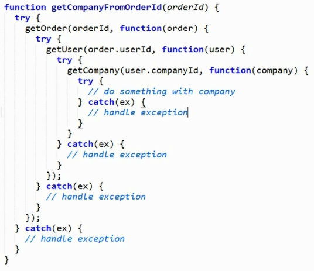
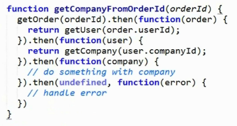

# Promise

Problem with callback:


Beautify of Promise:



## Basic of Promise

```
var promise = new Promise(function(resolve, reject){
	resolve("foo");
});

promise.then(function(data){
	console.log(data); //"foo"
});
```

For Jasmine, you need to call done() funciton to tell the test finished.
```
describe('Promise', function(){

	it('should receive the resolved data', function(done){
		var promise = new Promise(function(resole, reject){
			setTimeout(function(){
				resolve(1);
			}, 1000);			
			
		});
		
		promise.then(function(data){
			expect(data).toBe(1);
			done();
		});
	});
})
```

### Reject

```
	it('should fail when rejected', function(done){
		var promise = new Promise(function(resole, reject){
			reject(Error('oh no!'));
		});
		promise.then(function(){
			// when success
		}, function(error){
			expect(error.message).toBe('oh no!');
			done();
		});
	});
```

##### catch()

Only catch reject()

```
	it('should have a catch', function(done){
		var promise = new Promise(function(resole, reject){
			reject(Error('oh no!'));
		});
		promise.catch(function(){
			expect(error.message).toBe('oh no!');
			done();
		});
	});
```

### Call promise inside another promise

```
it('should compose when resolved with a promise', function(done){
	var promiseOld = new Promise(function(resolve, reject){
		resolve(3);
	});
	
	var promiseNew = new Promise(function(resolve, reject){
		resolve(promiseOld);
	});
	
	promiseNew.then(function(data){
		expect(data).toBe(3);
		done();
	});
});
```

## Shortcut

```
it('should have a static resolve', function(done){
	var promsieOld = Promise.resolve(3);
	
	var promiseNew = Promise.resolve(promsieOld);
	promiseNew.then(function(data){
		expect(data).toBe(3);
	});
});

it('should have a static reject', function(done){
	var promise = Promise.reject(Error('oh no!'));
	promise.catch(function(error){
		expect(error.message).toBe('oh no!');
		done();
	})
})
```

## Async

```
it('should be asynchronous', function(done){
	var async = false;
	var promise = Promise.resolve();
	promise.then(function(){
		expect(async).toBe(true);
	});
	async = true;
});
```


